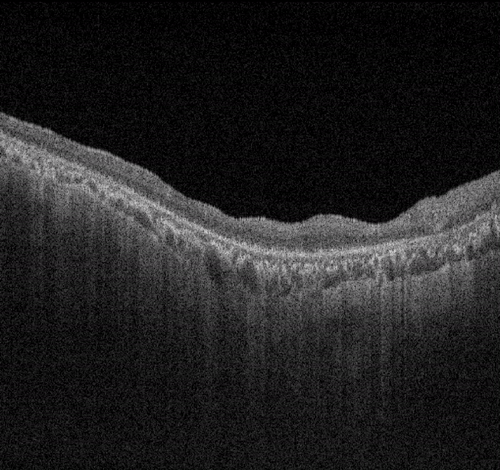
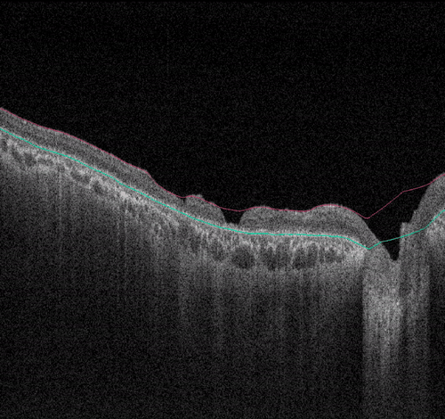
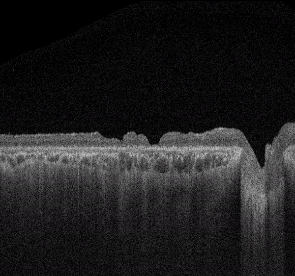
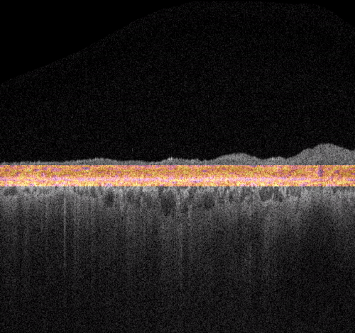
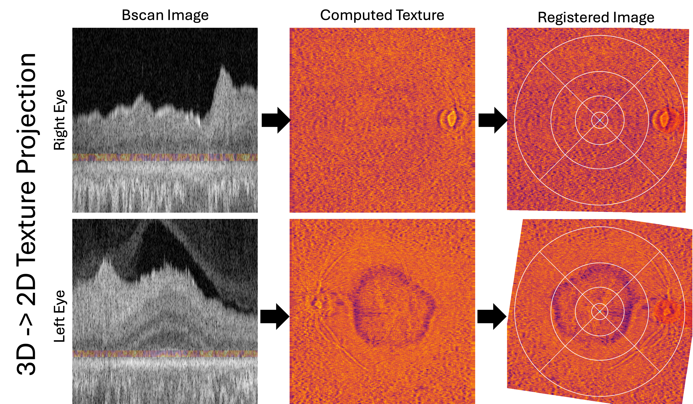
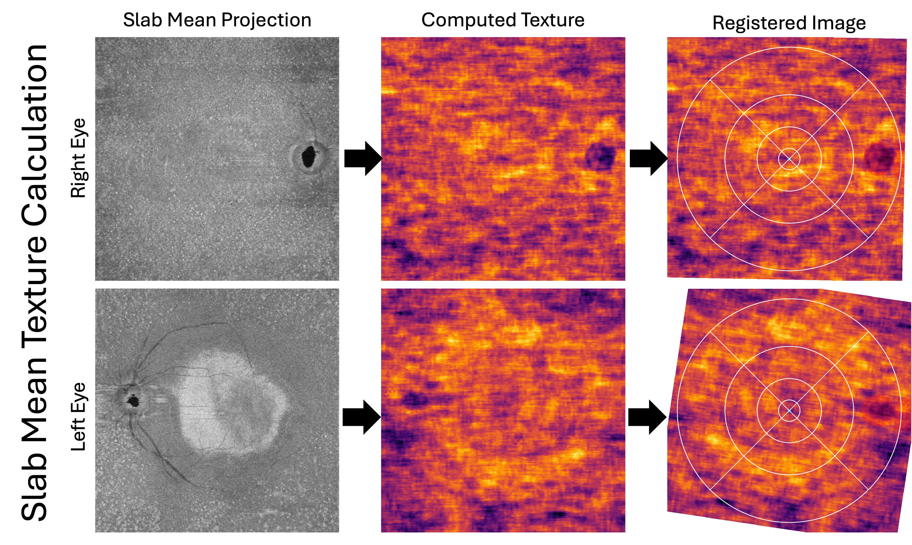
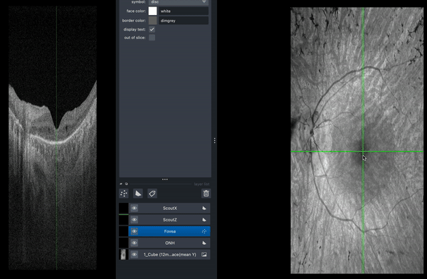

## Visual Overview

### Volume Processing

| Raw OCT volume | RPE/ILM segmentation |
|---|---|
|  |  |

| RPE-flattened volume | Texture volume (local binary pattern entropy) |
|---|---|
|  |  |

### En-face Outputs

  
  <em> 3D to 2D texture projection – 3D texture volume slabs are mean-projected to form an en face computed texture, which is then registered by rotation to align fovea and optic nerve head along the horizontal. Left eye is mirrored to match right eye. </em>

  
  <em>Slab-mean texture calculation – The mean of the outer-retinal slab is obtained, and the textures are calculated directly on the mean image and registered.</em>

### Development Tools

  
   
  <em>Interactive fovea / optic nerve head annotation tool.</em>

- Napari based tools for inspecting volumes, layers, and textures
    - Interactive for prototyping segmentations and debugging
- Annotation tools for data preprocessing (optic nerve head and fovea selection)

The license applies to source code in this repository. It does not grant rights to any clinical imaging data, annotations, trained models, or third-party datasets referenced by the code.
